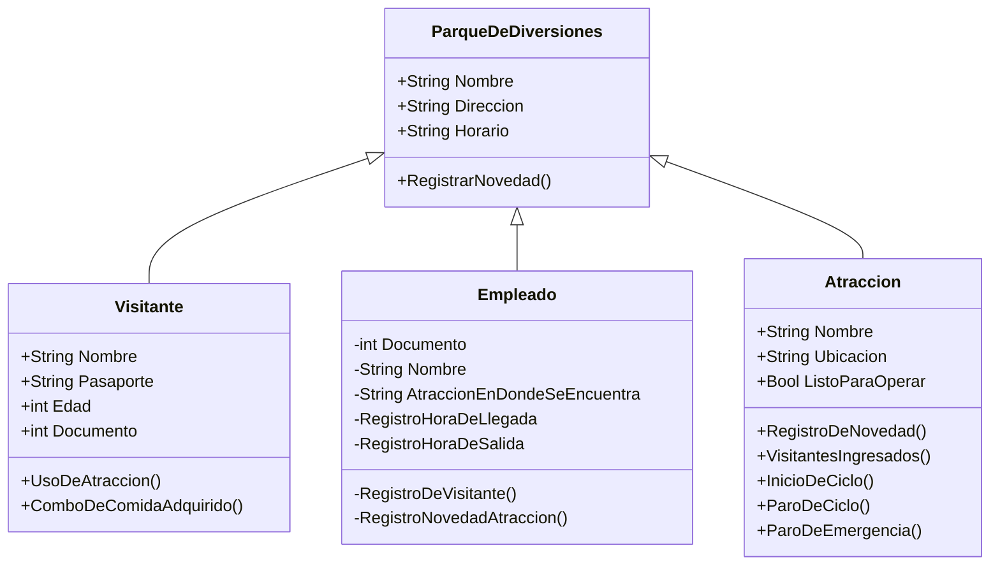

# Reto-2-POO

```mermaid
classDiagram
    ParqueDeDiversiones <|-- Visitante
    ParqueDeDiversiones <|-- Empleado
    ParqueDeDiversiones <|-- Atraccion
    ParqueDeDiversiones : +String Nombre
    ParqueDeDiversiones : +String Direccion
    ParqueDeDiversiones: +String Horario
    ParqueDeDiversiones: +RegistrarNovedad()
    class Visitante{
      +String Nombre
      +String Pasaporte
      +int Edad
      +int Documento
      +UsoDeAtraccion()
      +ComboDeComidaAdquirido()

    }
    class Empleado{
      -int Documento
      -String Nombre
      -String AtraccionEnDondeSeEncuentra
      -RegistroDeVisitante()
      -RegistroNovedadAtraccion()
      -RegistroHoraDeLlegada
      -RegistroHoraDeSalida
    }
    class Atraccion{
      +String Nombre
      +String Ubicacion
      +Bool ListoParaOperar
      +RegistroDeNovedad()
      +VisitantesIngresados()
      +InicioDeCiclo()
      +ParoDeCiclo()
      +ParoDeEmergencia()
    }
```
